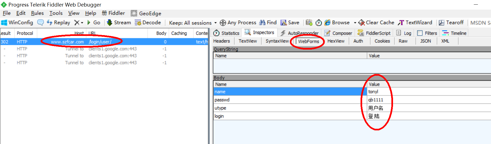
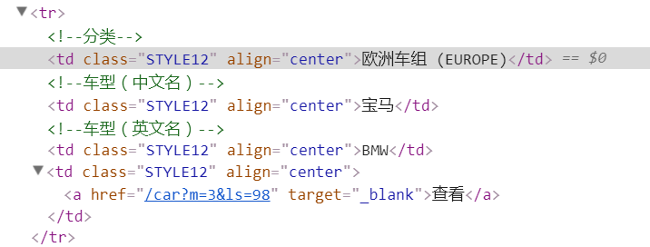
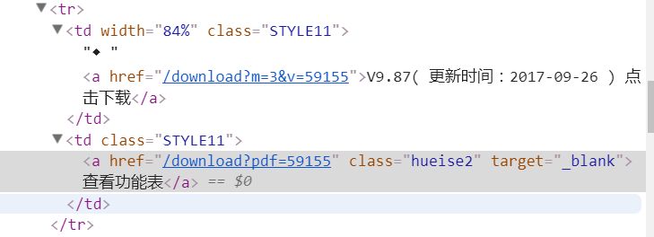
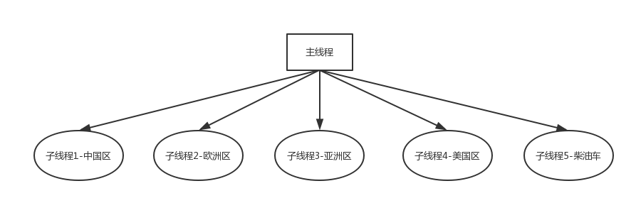

# 下载"深圳爱夫卡"上的诊断功能表




# 链接分析

## 根URL

```html
http://www.szfcar.com/
```

## 区域子URL:


|链接             | 区域    |
|-----------------|--------|
|/car?m=3&cs=2   | 中国车组 |
| /car?m=3&cs=11 | 亚洲车组 |
| /car?m=3&cs=5  | 欧洲车组 |
| /car?m=3&cs=3  | 美国车组 |
| /car?m=3&cs=102| 非洲车组 |
| /car?m=3&cs=9  | 柴油车型 |


## 车型表





```html
 <a href="/car?m=3&amp;ls=22" target="_blank">查看</a>
```

- 分页
    - &page=页号


## 不同版本pdf



```html
<a href="/download?pdf=59133" class="hueise2" target="_blank">查看功能表</a>
```


## pdf文件链接
```html
http://www.szfcar.com/download?pdf=59133
```


# 多线程设计




- JobDistribute() 根据任务数给每个子线程分配适当数量的下载任务
- threading.Thread(target=回调函数, args=(参数))  创建线程
- threading.Thread().start()  启动线程
- threading.Thread().join()  阻塞等待子线程结束

> 说明: 实际的线程数可以自定义


